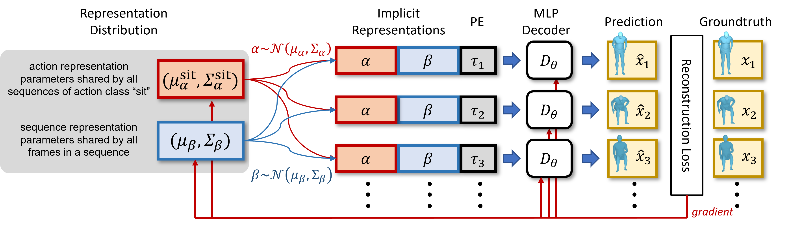

# Official Implementation of the paper "Implicit Neural Representations for Variable Length Human Motion Generation" (ECCV 2022)




[[More Visualizations]](etc/Visualizations.md)

## Bibtex
Please consider citing this work, if you find this code useful.
```
@article{cervantes2022implicit,
  title={Implicit Neural Representations for Variable Length Human Motion Generation},
  author={Cervantes, Pablo and Sekikawa, Yusuke and Sato, Ikuro and Shinoda, Koichi},
  journal={arXiv preprint arXiv:2203.13694},
  year={2022}
}
```
---
## Installation
```
pip install -r requirements.txt
pip install torch==1.8.1+cu101 torchvision==0.9.1+cu101 torchaudio==0.8.1 -f https://download.pytorch.org/whl/torch_stable.html
```

To install Pytorch3D follow the instructions [here](https://github.com/facebookresearch/pytorch3d/blob/main/INSTALL.md).
> For CUDA builds with versions earlier than CUDA 11, set `CUB_HOME`
```
pip install "git+https://github.com/facebookresearch/pytorch3d.git@v0.3.0"
```

--- 
## Data Preparation
### [Download datasets](etc/Datasets.md)
### [Download evaluation models](etc/EvalModels.md)
### [Download SMPL model](etc/SMPL.md)

---
## Usage
### Training
```
python3 ./ImplicitMotion/main.py 
	--path_config=/path/to/config-file
```

Before training you need to prepare a configuration file.
Configurations for the experiments in the paper are provided [here](configs).
Modifications for the following keyword arguments are necessary:
```
path_dataset: Path to dataset folder
path_results_base: Path to folder for saving checkpoints, etc. (arbitrary).
path_smpl: Path to SMPL file (.pkl)
```

### Evaluation
```
python3 ./ImplicitMotion/test/test_metric.py 
	--path_results /path/to/results
	--path_classifier /path/to/classifier
	--variable_length_testing
	--metrics
```

### Visualization
```
python3 ./ImplicitMotion/test/test_metric.py
	--path_results /path/to/results
	--path_classifier /path/to/classifier
	--variable_length_testing
	--video
	--num_videos 1
	--video_length 60
```

---
## License
This code is distributed under an [MIT LICENSE](LICENSE).